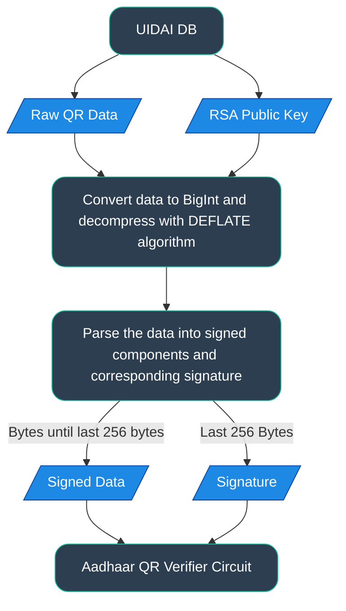
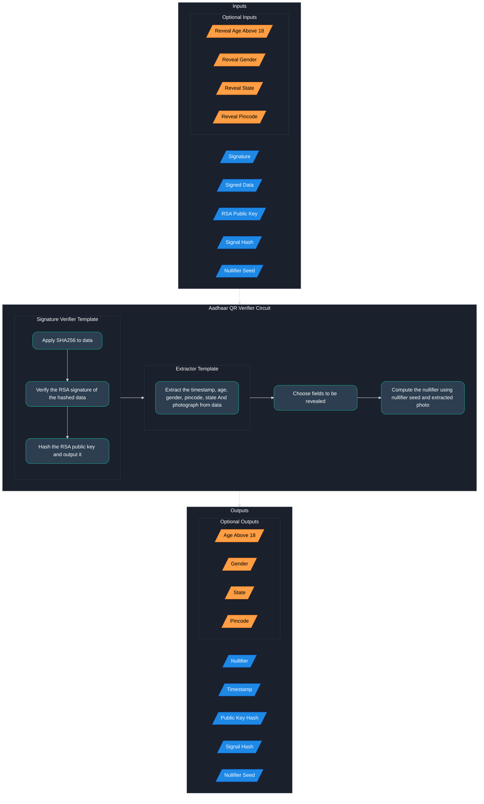

# Anon Aadhaar in o1js

Anon Aadhaar is a privacy-preserving protocol that enables users to prove specific attributes from their Aadhaar identity—such as age, residency, or gender—without revealing their full identity. It utilizes zero-knowledge proofs to allow users to generate verifiable claims based on data extracted from Aadhaar QR codes issued by the Indian government, ensuring that no sensitive personal information is exposed unless **explicitly** chosen by the user.

Anon Aadhaar protocol works on the client side, which ensures that no server stores user information. Users can generate ZK proofs (specifically, zk-SNARK proofs) on their device and use it for many use cases.

## What is Aadhaar?

**Aadhaar QR Code** is a machine-readable representation embedded in Aadhaar documents containing identity information such as name, gender, DOB, address, and a photograph. Issued by UIDAI, the QR code enables offline verification of Aadhaar data without needing internet access, ensuring authenticity and privacy.

In the Aadhaar QR code, identity data is embedded in a structured, encrypted format with a total size of up to 255 bytes. Each field occupies a fixed-length segment within this payload. For more detailed specifications of Aadhaar QR, please see the [official manual](https://uidai.gov.in/images/resource/User_manulal_QR_Code_15032019.pdf).

## How does it work?

The architecture is split into two parts: 1) Data Extraction & Processing 2) Proof Generation. 

In the first part, the user fetches data from UIDAI, validates it, and processes it to use it in circuits.

In the second part, by using user's private data, proof generation is done on the user’s device. 

### Data Extraction & Processing

In the first part of the protocol, these steps are followed:

- Data of a user is fetched in QR form and RSA Public Key issued by the Indian Government.
- The raw QR code contains data in compressed form. Data is decompressed into a byte array.
- The last 256 bytes of the decompressed data represent the signature of the corresponding identity data.
- The remaining byte array contains identity data, which can be parsed according to the specifications provided by UIDAI.



### Proof Generation

After the data is split into the **signature** and **signed data**, it can be used in a ZK circuit to prove identity information in a privacy-preserving manner. The verifier circuit for Aadhaar QR consists of two components: **Signature Verifier** and **Extractor**. In the signature verifier component, the RSA signature is verified, while in the extractor component, the fields in the data are extracted in a provable manner.

#### Inputs


The Aadhaar QR verifier circuit takes the following inputs:

- **Signature** and **signed data**, which are obtained off the circuit. The signature is used in the verification component together with the signed data.
- **RSA Public Key**, which is fetched from UIDAI off the circuit.
- **Signal Hash**: A hash of a user-chosen **signal**, which acts as a commitment to a public message. It's used in the circuit for two main reasons:
    - **Prevent front-running** – Binding the proof to a specific signal (e.g., an Ethereum address) ensures only the intended party can use it.
    - **Enable secure signing** – especially useful in ERC-4337 flows, where the signal can represent a specific action (like a transaction), tying the proof directly to that action.
- **Nullifier Seed**, which is used to generate a **nullifier** by hashing it with the user's photo. This prevents the same Aadhaar from being used multiple times for the same action or across apps, while keeping the identity private.
- **Reveal Age Above 18**, **Reveal Gender**, **Reveal State**, and **Reveal Pincode**, which are boolean inputs that allow the user to specify the identity fields to be revealed in the proof.

#### Signature Verifier Component


The signature verification is performed by this component using the signature and signed data, and follows these steps:

- The **Signature Verifier** template receives the signature and signed data.
- The signed data is hashed using the **SHA-256** algorithm.
- The hash of the data is then used in RSA signature verification.
- Upon successful verification, the RSA public key obtained from UIDAI is hashed and output to confirm that the correct public key was used for signature verification.

#### Extractor Component

For each field in the data, a dedicated extractor circuit is used to extract the value and apply the necessary constraints. Since each field has a predefined byte position, as specified by UIDAI, each extractor operates on **fixed byte offsets** corresponding to the field it extracts.

- Extraction proceeds in the following steps:
    - **Timestamp Extraction**: The timestamp indicating when the QR code was signed is extracted from the data. It is converted from IST to UNIX UTC format. Using this value, the year, month, and day are computed and returned as integers, along with the original timestamp.
    - **Age Extraction**: The date of birth is extracted from the Aadhaar data and converted into day, month, and year components. The circuit receives the current date as input and calculates the user's age in years. This value can be used to determine whether the user is over 18.
    - **Gender Extraction**: Gender is extracted from the data and returned as a single-byte integer representing the gender code.
    - **Pincode Extraction**: The pincode is extracted by reading a predefined byte range within the address field. It is returned as a 6-digit integer representing the user's postal code.
    - **Photograph Extraction**: The photograph is extracted from the data, depending on the version of the Aadhaar QR code. It is returned as a big-endian integer array—typically of length 33—representing the encoded image data.

#### Outputs


Along with the proof, the following values are output:

- **Nullifier**, calculated using photograph bytes and the nullifier seed.
- **Timestamp**, obtained from the **Timestamp Extractor** component.
- **Public Key Hash**, derived by hashing the RSA public key in the signature verifier component.
- **Signal Hash**, the same hash provided as input by the user.
- **Nullifier Seed**, returned as is for verification.
- **Age Above 18**, **Gender**, **State**, and **Pincode**, extracted from the identity data and revealed based on the user's disclosure preferences.



## Resources

- [Anon Aadhaar Documentation](https://documentation.anon-aadhaar.pse.dev/docs/intro) - Comprehensive guide on the Anon Aadhaar system, provided by the PSE team.
- [Anon Aadhaar Implementation](https://github.com/anon-aadhaar/anon-aadhaar/tree/main) - The official repository for Anon Aadhaar implementation by the PSE team in Circom.
- [Aadhaar Secure QR Code Specification](https://uidai.gov.in/images/resource/User_manulal_QR_Code_15032019.pdf) -  This document provides the detailed specification for the Secure QR code used in Aadhaar.

# How to Build & Test

## How to build

```sh
pnpm run build
```

## How to run tests

```sh
pnpm run test
```

## How to run benchmark
[Benchmark Results](./benchmark.md)

When the benchmark is run using the following command, it should produce a table in the same format as shown in `benchmark.md`.

```sh
cd packages/core && pnpm run benchmark
```
